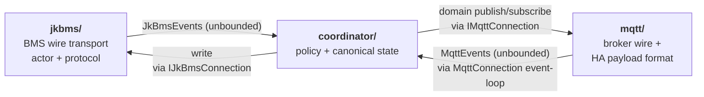
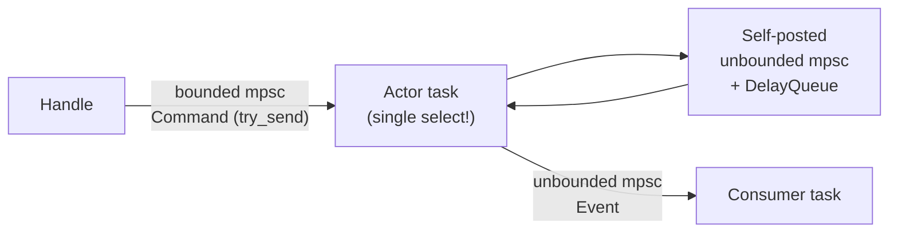
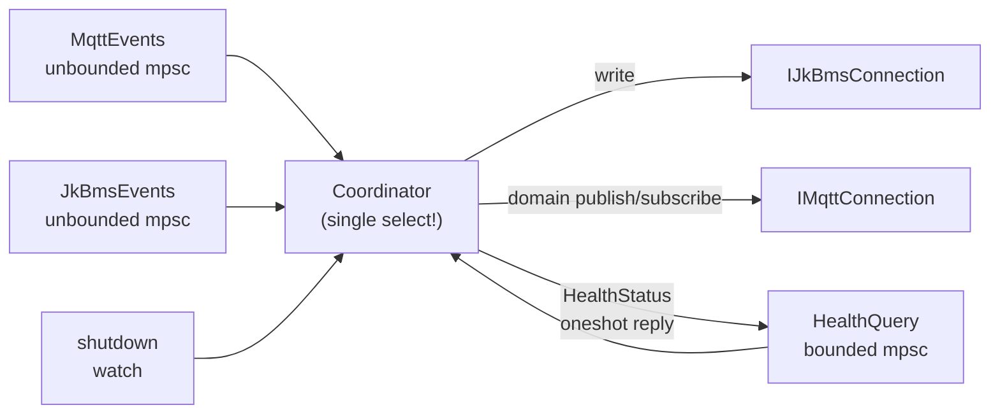
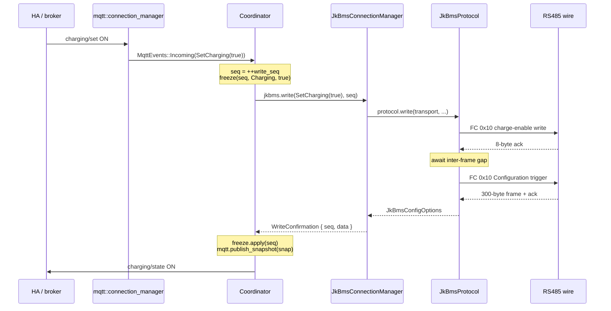
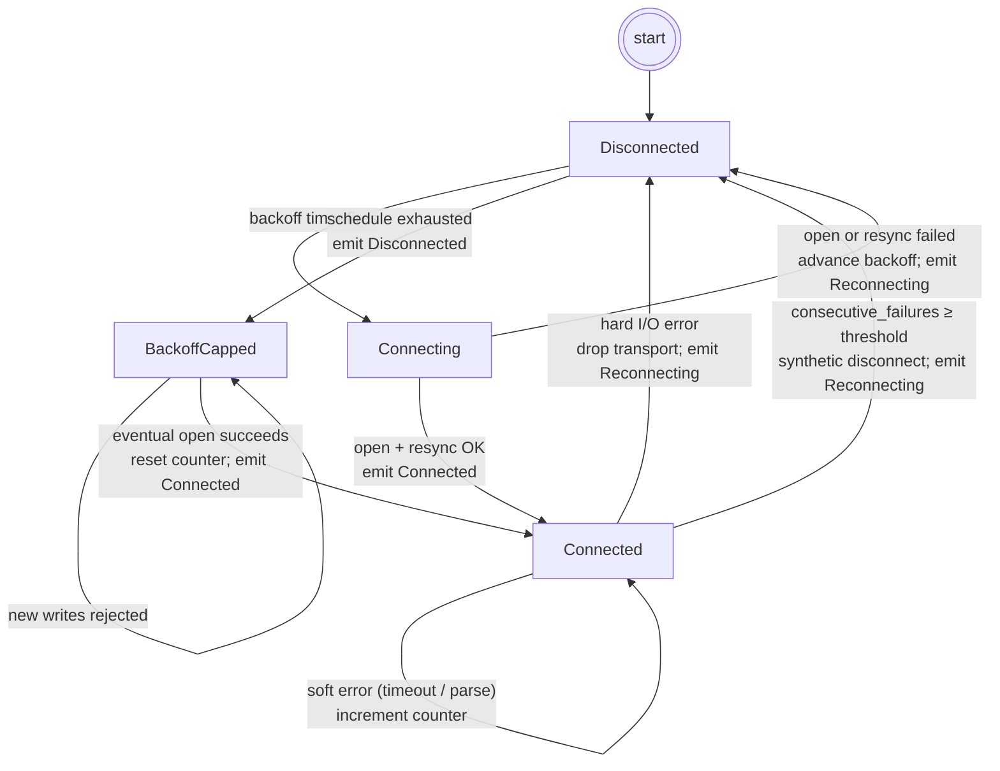
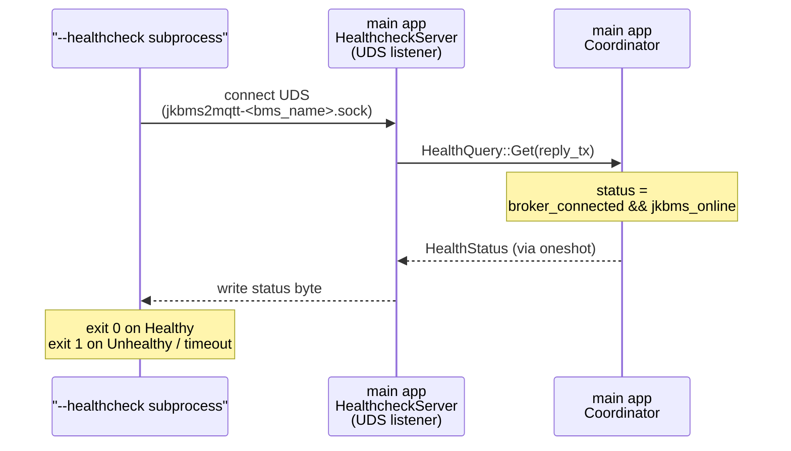

# jkbms2mqtt — Architecture

Decision record for jkbms2mqtt, paired with [REQUIREMENTS.md](REQUIREMENTS.md) (observable behavior), [doc/jkbms-protocol.md](doc/jkbms-protocol.md) (wire), and [doc/mqtt-topics.md](doc/mqtt-topics.md) (topic schema). The source tree under `src/` is the source of truth for file/struct/const detail. This document records *why* the structure is the way it is.

---

## 1. Overview

Single Rust binary in an Alpine arm64 container. Owns one RS485 serial port and one MQTT connection. All concurrency is Tokio; there is no thread pool of workers and no shared-state mutex. Cross-task coordination is exclusively via typed channels.

Two organizing principles drive the design:

- **Actor-based serialization.** Each shared, stateful resource (serial port; MQTT client) is owned by exactly one task — its *actor* — reached only by sending typed messages over channels. The actor's single consumer holds a typed-message *handle* that turns method calls into messages; the actor processes them one at a time, so state needs no locks (Alice Ryhl, "Actors with Tokio").
- **Narrow trait seams.** The side-effecting boundaries (serial port, MQTT client) sit behind small traits. Production uses `tokio-serial` and `rumqttc`; tests use scripted fakes.

Everything else — frame parsing, alarm decoding, cell aggregates, ISO-8601 duration formatting, HA discovery payload construction — is a pure function, trivially unit-testable without async.

---

## 2. Module layering

Three peer modules shaped by the hardware boundary. Each has one job; only `coordinator/` holds multi-event state.

- **`jkbms/`** speaks the BMS wire. Owns the serial connection; parses frames; emits `JkBmsEvents`. Knows nothing about MQTT.
- **`mqtt/`** speaks the broker wire and HA's payload conventions. Pure functions plus a thin rumqttc adapter. No held state across events.
- **`coordinator/`** holds the canonical view of the BMS and decides what gets published, when. The only module that owns multi-event state.

`coordinator/` depends on the two transports only through their public traits (`IJkBmsConnection`, `IMqttConnection`). Either transport can be swapped without touching policy; policy can be tested without spinning up either transport.

Alongside these three, a few leaf modules exist:

- **`domain/`** — shared value types (`Snapshot`) crossing the module boundary between `jkbms/` fetches and `mqtt/` publishes.
- **`healthcheck/`** — Unix Domain Socket server + client used by the `--healthcheck` subprocess mode (see §10).
- **`supervisor.rs`** — top-level restart supervisor for the coordinator task (see §4).
- **`config.rs`** / **`main.rs`** — configuration loading and binary entry point.

---

## 3. Tech stack

| Crate | Role | Key decision |
|---|---|---|
| `tokio` | Async runtime + `mpsc`/`oneshot`/`watch`/`broadcast` + `time::pause()` | Multi-thread runtime; sole concurrency primitive set |
| `tokio-serial` | RS485 async I/O | Built **without** `libudev` — device path is static, no enumeration, musl-friendly |
| `rumqttc` | Async MQTT client | Handles LWT, reconnect, QoS, retained flag |
| `bytes`, `serde`, `envy`, `config` | Config + buffers | `envy` first, optional TOML fallback |
| `tracing` + `tracing-subscriber` | Structured logs | JSON in prod, pretty in dev |
| `thiserror` / `anyhow` | Typed errors per module / top-level context | `anyhow` only in `main()` |
| `time` | ISO-8601 duration | Smaller and musl-friendlier than `chrono` |

**Crates deliberately not used.**

- `tokio-modbus` / `rmodbus` — the BMS mixes FC `0x10` triggers with non-Modbus 300-byte JK frames on the same line; no library models this. Framing is hand-rolled in `jkbms/protocol.rs`.
- `actix` / `kameo` / `ractor` — two actors at this scale do not justify a framework. Plain `tokio::sync::mpsc` per actor.
- `mockall` — hand-rolled mocks are easier to read at this size.

---

## 4. Concurrency model — actor + handle

### Actor / handle pattern

Actor is a single `async fn run(...)` task with private state and one `select!` loop. Its consumer holds a typed-message handle that translates method calls into messages over a bounded `mpsc`. The actor processes messages one at a time; state is local and lock-free.

### Channel types per role

| Channel | Why this type |
|---|---|
| Inbound commands (bounded) | Backpressure surfaces to the caller as `RateLimitExceeded` from `try_send`; never blocks the actor |
| Self-posted internal commands (unbounded mpsc) | Actor is the **only** drainer; a bounded self-send from inside a handler would deadlock when full |
| Self-armed timers (`DelayQueue`) | One timer wheel polled inside `select!`; replaces spawning a task per timer; controlled by virtual time in tests |
| Outbound events (unbounded mpsc) | Blocking on a slow/absent consumer would stall the serial exchange |

### Tasks at runtime

| Task | Owns | Inbox | Outbox |
|---|---|---|---|
| `jkbms_connection_manager` | transport (lifecycle), `JkBmsProtocol`, reconnect/polling state, pending write queue, `DelayQueue` | `JkBmsCommands` (bounded) + self-posted internals (unbounded) + `DelayQueue` | `JkBmsEvents` (unbounded) |
| `coordinator` | `IMqttConnection`, `IJkBmsConnection`, `StateAggregator`, `SwitchFreeze`, `broker_connected`/`jkbms_online` bools, write seq | `MqttEvents` (unbounded) + `JkBmsEvents` (unbounded) + `HealthQuery` (bounded, from healthcheck server) + shutdown `watch` | direct calls on the two trait handles + `HealthStatus` on `HealthQuery` oneshot replies |
| `mqtt_connection_manager` | `rumqttc::(AsyncClient, EventLoop)` (spawned inside `MqttConnection::new`); runs the reconnect loop | broker `Event` stream + `MqttCommand`s from the handle | `MqttEvents` (unbounded) to coordinator |
| `healthcheck_server` | UDS `Listener`, per-connection accept tasks (spawned inside `HealthcheckServer::new`) | `Listener::accept()` | `HealthQuery::Get(oneshot_reply)` to coordinator |
| `supervisor` | `CoordinatorHandle` (coordinator only) | task exits/panics | restart with backoff |

Polling cadence is owned by the connection manager — the coordinator never schedules reads. The handle exposes only `write`.

---

## 5. Trait seams

Two purposes: keep each module reachable through one narrow interface (so `jkbms/`, `mqtt/`, `coordinator/`, `healthcheck/` never grow tendrils into each other), and let every module be exercised in isolation without a serial port, a broker, or real time.

**Public boundaries.** Everything a module offers to the rest of the process is one small trait plus an unbounded events channel back:

| Module | Public trait (used by `coordinator/`) | Events channel (back to `coordinator/`) | What it hides |
|---|---|---|---|
| `jkbms/` | `IJkBmsConnection` — `write(command, seq)`, `stop()` | `JkBmsEvents` (`Connection(ConnectionState)`, `Data(...)`, `WriteConfirmation`, `WriteError`) | serial transport, protocol framing, reconnect/polling, write queue |
| `mqtt/` | `IMqttConnection` — `publish_snapshot`, `publish_discovery`, `publish_availability`, `subscribe_to_commands`, `stop` | `MqttEvents` (`BrokerConnected`, `BrokerDisconnected`, `Incoming(IncomingRequest)`) | rumqttc types, topic strings, HA payload construction, LWT, reconnect |
| `healthcheck/` | `HealthcheckServer::new(...)` (plain struct, no trait) | `HealthQuery::Get(oneshot_reply)` on a bounded mpsc | UDS listener, per-connection accept tasks |

The coordinator never sees a `SerialStream`, an `AsyncClient`, a topic string, or a UDS handle — those types are private to their module. Symmetrically, `jkbms/` and `mqtt/` never import `coordinator` types.

**Testability.** Every public trait has a hand-rolled mock in the corresponding `tests/support/` (e.g. `MqttConnectionMock` records `publish_snapshot`/`publish_availability`/… calls, and exposes an `events_tx` so tests can inject `MqttEvents` symmetrically with how they inject `JkBmsEvents`). Combined with `tokio::time::pause()` (§6), coordinator tests assert policy — *"snapshot published with `total_voltage_v = 26.4`"* — instead of wire bytes.

**One extra split inside `jkbms/`.** The BMS actor's dependency on the wire is broken in two, so protocol tests and actor tests don't share fixtures:

- `IJkBmsTransport` — byte-level (`read_exact` / `write_all`). Companion `IJkBmsTransportOpener` scripts open/reopen. Protocol tests script bytes.
- `IJkBmsProtocol` — one method per BMS operation (`poll_device_info`, `poll_config`, `poll_operational`, `poll_alarms`, `write`), each taking `&mut dyn IJkBmsTransport` per call. Actor tests script logical returns.

The actor owns the transport (so it can drop-and-reopen on hard I/O) while the protocol instance survives the reopen. This split lets `JkBmsProtocol` own an **inter-frame gap** invariant — an application-level pause sized for BMS firmware settling, larger than Modbus's 3.5-character minimum — enforced via a single `last_serial_activity: Option<Instant>` field and an `await_gap` helper called at the head of each `poll_*` and at both TX halves of `write`. Because the gap lives behind the trait, no actor change can bypass it; because `last_serial_activity` survives a transport drop, the first poll after a reopen runs immediately.

`mqtt/` needs no such split: rumqttc is a single injection point, and topic/HA payload construction is pure and unit-tested directly.

---

## 6. Virtual time — no `Clock` trait

A `Clock` trait (or any injectable now-function) is deliberately omitted. Both actors and `JkBmsProtocol` measure time with **`tokio::time::Instant`**, not `std::time::Instant`. `tokio::time::Instant::now()` / `.elapsed()` are driven by the same virtual clock as `tokio::time::sleep`, `tokio::time::timeout`, and `DelayQueue` — so a single `tokio::time::pause()` plus `advance()` freezes and fast-forwards **all** time-dependent logic across the layer boundary at once: reconnect backoff, the poll-interval `due()` checks, the write-queue TTL eviction, the inter-frame gap, and the per-read timeout.

This matters because the timing tunables are compile-time `const`s rather than runtime config: tests cannot shrink them, so they advance virtual time past the constant instead. `std::time::Instant` reads the OS monotonic clock unaffected by `pause()` — which is the reason every time-sensitive module imports `tokio::time::Instant` explicitly. A custom `Clock` trait would add a trait object for no benefit over the built-in virtual clock.

---

## 7. Coordinator policy

`jkbms/` knows the BMS protocol; `mqtt/` knows the broker wire and HA's payload conventions. Neither knows what a *write confirmation should do to the published switch state*, when to translate a serial `ConnectionState` transition into an HA availability flip, or how to collect and hold the canonical view of a device whose information arrives in four fragmented frame types. That cross-cutting policy has to live somewhere; if it leaks into either adapter, both stop being swappable.

The coordinator multiplexes three inbound sources plus a shutdown watch. `MqttEvents` carries broker-connect / broker-disconnect notifications and inbound MQTT commands in a single enum, so the `select!` arm is a match over `MqttEvents` rather than separate inbox channels. There is no timer wheel — the coordinator owns no periodic work; every event-driven action is triggered by an incoming message.

### Sub-components

| Component | Shape | Responsibility |
|---|---|---|
| `StateAggregator` | plain struct | Caches the latest of each `JkBmsData` variant; merges them into a `Snapshot` on demand. Returns `Option<Snapshot>` (None until `cell_count` is known and at least one `OperationalData` has arrived). |
| `SwitchFreeze` | plain struct | Per-switch `Option<(seq, optimistic_value)>`. Suppresses pre-write switch values during the BMS round-trip so HA's optimistic UI doesn't bounce. Newer-or-equal seq wins on confirmation; cleared on error. |
| Availability (inline) | two bools on `Coordinator` | `broker_connected` and `jkbms_online`. Both are event-driven, not liveness-timed. `jkbms_online` flips true on `ConnectionState::Connected` and false on `ConnectionState::Disconnected`; `ConnectionState::Reconnecting` is deliberately kept online so a transient serial bounce during the fast-reconnect window does not mark HA entities unavailable. `broker_connected` follows `MqttEvents::BrokerConnected` / `BrokerDisconnected`. |

`StateAggregator` and `SwitchFreeze` are pure structs with no async and no I/O. They get focused tests with no setup beyond constructor calls. Availability being derived from the `ConnectionState` enum means the "how long is too long?" policy lives in `jkbms_connection_manager` (as the reconnect-backoff cap) rather than in the coordinator.

### Discovery republish — only on MQTT broker connect

HA Discovery is built once when the first `DeviceInfo` and the first `ConfigOptions` (carrying `cell_count`) have both arrived. It is **not** republished on jkbms reconnect — the BMS identity has not changed and a republish would briefly mark entities unavailable. Discovery republish is fired only by `MqttEvents::BrokerConnected`: at that point HA may have lost the retained state and needs everything re-shipped (subscribe + discovery + availability + the cached last snapshot).

### Public handle is thin

The `CoordinatorHandle` (`src/coordinator/handle.rs`) exposes only lifecycle: `new(...)` (spawn), `Future` (poll for exit), and `stop()` (fire the shutdown watch and return the `JoinHandle`). It has no method to enqueue work — every runtime input arrives on channels whose sender ends are already held by the mqtt and jkbms managers (and the healthcheck server). The supervisor is the sole holder of the handle and re-creates it on restart.

---

## 8. Read-after-write sequencing

Realizes FR-1 end-to-end. The state topic only ever reflects a value read back from the BMS — no code path publishes `charging/state` optimistically from the `/set` payload.

Two consequences of running both wire ops inside one `protocol.write` call, which itself runs inside one actor handler:

- **Wire-level atomicity.** The actor only inspects its inbox between `JkBmsCommands`. A second `Write` or a `RunDataPolling` cannot interleave between the FC `0x10` write and the readback because the trait method does not yield to the actor's `select!` between the two TX frames.
- **Inter-frame gap is still observed** between the two master→slave frames inside `protocol.write`, via the same `await_gap` the protocol uses between any consecutive TX. "Immediately re-trigger" in FR-1 means "before the next poller cycle," not "skip the RS485 silence."

`SwitchFreeze` suppresses the pre-write value during the round-trip; it does not invent a new one. On `WriteConfirmation` the freeze applies (the BMS-confirmed value publishes). On `WriteError` the freeze clears (the last known actual value publishes next cycle).

---

## 9. Serial resilience

Realizes NFR-5.

### Connection lifecycle

Status is emitted as `JkBmsEvents::Connection(ConnectionState)`:

- `Connected` — after a successful open + resync.
- `Reconnecting` — each reopen attempt inside the backoff window; coordinator keeps availability online.
- `Disconnected` — once the backoff caps out; coordinator flips availability offline.

### Hard vs soft errors

- **Hard** — any `io::Error` kind other than `TimedOut` (including `UnexpectedEof`). Drops the transport, schedules the next `Connect` on the `DelayQueue`, and emits `Reconnecting` (or `Disconnected` once the backoff schedule caps out). Idempotent: a second hard error during an outage is a no-op since the transport is already `None`. There is no partial-frame buffer to clear — reads use fixed-size `read_exact` into stack buffers.
- **Soft** — read timeout or parse error (bad checksum / magic / length). Increments a `consecutive_failures` counter; a successful `OperationalData` parse clears it; successes on other poll types leave it unchanged so alarm/config successes don't suppress escalation.

### Backoff schedule

Deterministic fixed-delay list: five fast attempts summing to roughly 10 seconds, then a steady-state cap.

Once the schedule exhausts, the manager enters "backoff capped": new writes are rejected outright. The actor still attempts reconnect at the cap interval.

### Stuck-state escalation

When `consecutive_failures` hits the threshold, the actor forces a *synthetic* disconnect — the same path as a real disconnect. This covers silent failure modes where the USB-RS485 converter latches into a state with no fd error and no valid data.

### Command handling while disconnected

`RunDataPolling` is a no-op while disconnected (re-armed on the next successful `Connect`). `Connect` is a no-op when a transport already exists.

**Writes** are FIFO-queued with their original `seq`, bounded capacity (`PENDING_WRITES_CAP=5`). The *newest* is refused on overflow so in-flight FIFO order is preserved. The queue is also refused outright once the backoff schedule is capped (a prompt `WriteError` beats a TTL-expired write later). Each queued write carries `queued_at` and is dropped with `WriteError` if it ages past `WRITE_TTL` (10s) before retry.

### Post-reopen resync

`connect()` runs the same three polls as the FR-2 startup, in order: `DeviceInfo` → `ConfigOptions` → `OperationalData`. On success, in order: emit `JkBmsEvents::Connection(Connected)`; arm `RunDataPolling`; arm `RetryWrites` if queued writes remain. On failure, `handle_disconnect` runs and the backoff cycle continues; the write queue persists across reconnect attempts.

---

## 10. Healthcheck

`--healthcheck` is a separate subprocess mode that queries the running app's status over a local Unix Domain Socket. The main app owns a `HealthcheckServer` task; the subprocess owns a `HealthcheckClient` that connects to it, reads a `HealthStatus` byte, and exits 0 (`Healthy`) or 1 (`Unhealthy` / any error).

---

## 11. Build & deployment

Deployment shape (target platform, non-root user, healthcheck behavior, device passthrough) is specified in REQUIREMENTS.md NFR-2. The build mechanics:

- **`aarch64-unknown-linux-musl`** — fully static binary, zero runtime deps. Built with `cross`.
- **`tokio-serial` without the `libudev` feature.** The device path is a configured literal (the Compose mapping presents a fixed in-container path, NFR-2); no enumeration is required. Dropping `libudev` keeps the musl build self-contained and avoids dynamic linking.
- **Multi-stage Dockerfile.** `ghcr.io/cross-rs/aarch64-unknown-linux-musl` builder → `alpine:3` runtime, non-root user, `HEALTHCHECK` invokes the binary's own `--healthcheck` subcommand.

---

## 12. Testing seams

The four trait seams above (`IJkBmsTransport`, `IJkBmsProtocol`, `IMqttConnection`, `IJkBmsConnection`) plus the virtual clock are the only mocking surface the test suite needs. Pure functions (parsers, aggregates, alarm decode, duration formatting, discovery payload builders, per-entity formatters, the inbound MQTT topic router) are tested directly without async.

**Module test convention.** Tests live as a `#[cfg(test)] mod tests;` submodule **inside the module directory** (`src/<module>/tests/`), not in the crate-level `tests/` tree. This keeps tests, support code, and fixtures co-located with the module they cover and avoids polluting the public API surface. Test files are named `<component>_test.rs` for editor identifiability; support fakes live in `tests/support/`. Private functions are exposed to tests via a `#[cfg(test)] pub(super) mod internals` wrapper of thin `pub fn` re-exports (E0364 forbids direct re-export of private items from child modules).
